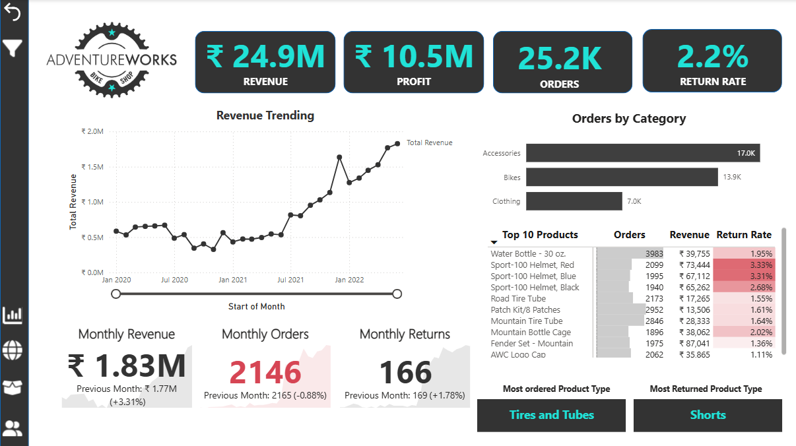
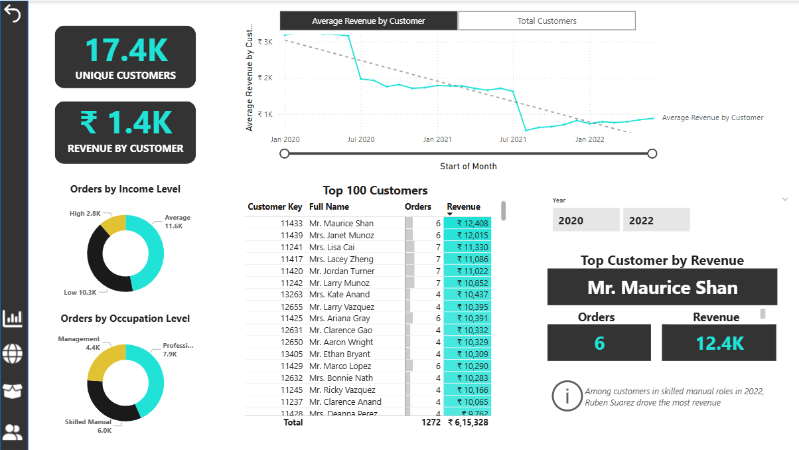
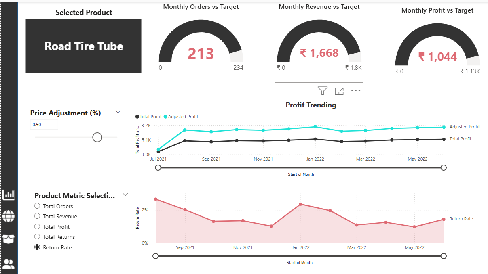
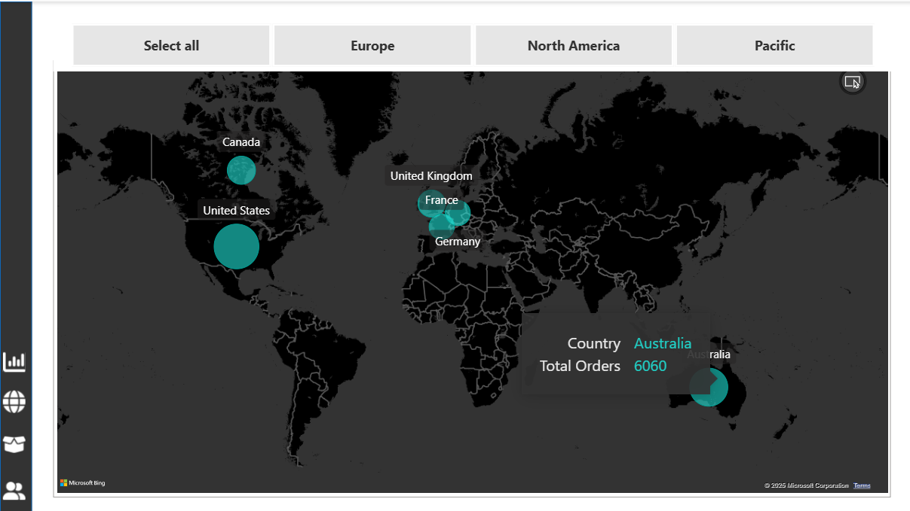
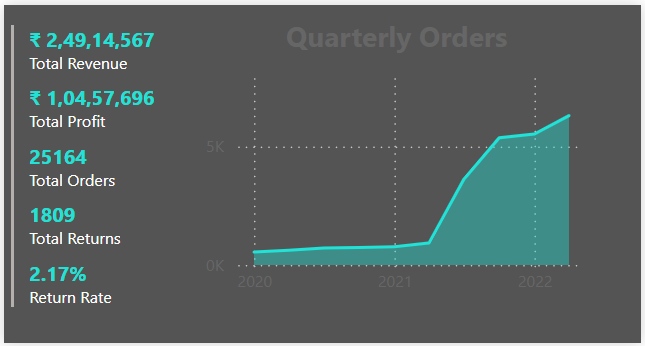

Overview
=============
This is a project in which I analyse the sales and returns information for a certain company AdventureWorks based on a set of factors.
These factors include:

1. Dates and Times
2. Customer Information
3. Product Information
4. Territory Information.

Snowflake is used to store raw and processed data. It is also used to process all DAX queries from PowerBI.
PowerBI is used for the visualisation purposes.
dbt is used for all transformations.

Screenshots of all the pages in the final Report.
==================================================

  <figure>
    
    <figcaption style="text-align:center; font-style:italic; margin-top:8px;">
      Figure 1: Exec dashboard
    </figcaption>
  </figure>

  <figure>
    
    <figcaption style="text-align:center; font-style:italic; margin-top:8px;">
      Figure 2: Customer Detail
    </figcaption>
  </figure>

  <figure>
    
    <figcaption style="text-align:center; font-style:italic; margin-top:8px;">
      Figure 3: Product Detail
    </figcaption>
  </figure>

  <figure>
    
    <figcaption style="text-align:center; font-style:italic; margin-top:8px;">
      Figure 4: Map Visual
    </figcaption>
  </figure>

  <figure>
    
    <figcaption style="text-align:center; font-style:italic; margin-top:8px;">
      Figure 1: Custom Tooltip
    </figcaption>
  </figure>

